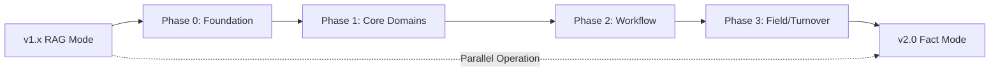

# SerapeumAI v2.0 Roadmap — AECO Truth Engine

**Status:** Vision / Planning Phase  
**Last Updated:** 2026-02-05

---

## Executive Summary

SerapeumAI is evolving from a **RAG-based document assistant** (v1.x) to an **offline engineering truth system** (v2.0). This roadmap defines the phased implementation plan to achieve the vision described in the AECO Truth Engine Build Bible while maintaining current capabilities.

---

## Current State (v1.x)

### What We Have
- **Windows desktop app** with local LLM support
- **Document ingestion**: PDF, Office, CAD (DXF), images
- **RAG-based chat** with document-grounded answers and citations
- **Vision processing**: OCR, layout analysis, entity extraction
- **Compliance workflow**: Standards selection → analysis → findings
- **Cross-document linking**: Relationship graph view
- **SQLite database**: `documents`, `pages`, `doc_blocks`, `chat_history`

### Architecture Pattern
```
User Query → RAG (Evidence Pack) → LLM → Answer + Citations
```

### Strengths
- Fast to start, easy to use
- Privacy-first (fully offline)
- Evidence-backed answers with page/cell citations
- Handles mixed document types

### Limitations
- No fact validation/certification layer
- No version control for extracted data
- No reproducibility guarantees
- No "as-of" snapshot system
- LLM can answer from incomplete evidence
- No conflict detection/resolution
- No deterministic extractors with provenance

---

## Future Vision (v2.0)

### What We're Building
An **offline engineering truth system** that:
- Ingests engineering artifacts (IFC/BIM, P6, PDFs, Office, emails, logs)
- Runs **deterministic extractors** → structured staging tables with provenance
- Runs **deterministic fact builders** → explicit computed facts with lineage
- Validates/certifies facts via rules + human queue
- LLM is a **query planner + narrator** (answers ONLY from certified facts)
- If facts are missing, LLM **refuses** and outputs coverage gap + job plan

### Architecture Pattern
```
Files → Extractors → Staging → Fact Builders → Validation → Certified Facts
                                                                    ↓
User Query → Template Match → Coverage Check → Fact API → Answer + Citations
                                    ↓ (if incomplete)
                              REFUSE + Gap Report
```

### Non-Negotiable Guarantees
1. **Strictness**: Assistant refuses claims not supported by certified facts
2. **Reproducibility**: Same file versions + extractor versions → same facts
3. **Provenance**: Every answer cites facts; every fact cites evidence locations
4. **Version Correctness**: Facts computed "as-of" explicit snapshot; superseded facts remain in history
5. **Conflict Safety**: If conflicting certified facts exist, assistant discloses conflict

---

## Implementation Strategy

### Approach: **Incremental Evolution**
- Current v1.x system continues to operate
- Add v2.0 components incrementally
- Maintain backward compatibility during transition
- Dual-mode operation: RAG mode (v1.x) + Fact mode (v2.0)

### Migration Path


---

## Phase Breakdown

### Phase 0: Foundation (Spine)
**Goal:** Build infrastructure for fact-based system  
**Duration:** 8-12 weeks  
**Deliverables:**
- Extended DB schema (file_version, extraction_run, fact, fact_input, link, validation_run, certification, conflict)
- Job queue + dependency graph
- Extractor SDK + runner
- Fact Builder SDK + runner
- Validation framework + certification queue
- Fact Query API (whitelisted)
- Chat orchestrator (strict protocol)

**Status:** Not Started  
**Details:** [`PHASE_0_FOUNDATION.md`](PHASE_0_FOUNDATION.md)

---

### Phase 1: Core Domains
**Goal:** Enable high-value question templates (schedule, BIM, documents)  
**Duration:** 12-16 weeks  
**Deliverables:**
- P6 extractor + schedule snapshot + schedule builder + validations
- IFC extractor + BIM snapshot + BIM builder + validations
- Document register + revision engine (PDF/Office basic)
- Question templates T01-T12 (design changes, critical path, RFI impacts)

**Status:** Not Started  
**Details:** [`PHASE_1_CORE_DOMAINS.md`](PHASE_1_CORE_DOMAINS.md)

---

### Phase 2: Workflow & Procurement
**Goal:** Enable gating/blocking question templates  
**Duration:** 8-12 weeks  
**Deliverables:**
- RFI/submittal/permit registers ingestion (from Excel/PDF/email logs)
- Link builders for workflow→elements/docs/system/zone (validated)
- Procurement ingestion + fit/load checks
- Question templates T13-T25 (pending submittals, material approvals, delivery conflicts)

**Status:** Not Started  
**Details:** [`PHASE_2_WORKFLOW_PROCUREMENT.md`](PHASE_2_WORKFLOW_PROCUREMENT.md)

---

### Phase 3: Field Reality & Turnover
**Goal:** Enable as-built and commissioning question templates  
**Duration:** 12-16 weeks  
**Deliverables:**
- Installation/inspection logs ingestion
- As-built/redlines ingestion
- Commissioning registers ingestion
- BAS mapping ingestion
- Point cloud/scan pipeline (optional)
- Question templates T26-T40 (field vs. model, turnover readiness, digital twin)

**Status:** Not Started  
**Details:** [`PHASE_3_FIELD_TURNOVER.md`](PHASE_3_FIELD_TURNOVER.md)

---

## Key Decisions

### Decision 1: Dual-Mode Operation
**Choice:** Run v1.x RAG mode and v2.0 Fact mode in parallel  
**Rationale:** Allows users to continue using current features while v2.0 matures  
**Implementation:** UI toggle or automatic mode selection based on data availability

### Decision 2: Incremental Schema Migration
**Choice:** Add v2.0 tables alongside v1.x tables  
**Rationale:** Avoids breaking existing functionality  
**Implementation:** New migration files (003+) add fact layer without modifying existing tables

### Decision 3: Extractor Refactoring
**Choice:** Wrap existing processors in Extractor SDK contract  
**Rationale:** Reuse existing PDF/Office/CAD processing logic  
**Implementation:** Create adapter layer that adds versioning + provenance metadata

### Decision 4: Question Template Library
**Choice:** Store templates as DB metadata + execution logic  
**Rationale:** Allows dynamic template updates without code changes  
**Implementation:** New `question_template` table with required_fact_types, required_link_types, coverage_check_logic

---

## Success Metrics

### Phase 0 Success Criteria
- [ ] All v2.0 tables created and indexed
- [ ] Job queue processes 100+ jobs without failure
- [ ] Extractor SDK contract documented with 2+ reference implementations
- [ ] Fact Query API returns FactPacket with lineage
- [ ] Validation framework runs 10+ rules on test facts

### Phase 1 Success Criteria
- [ ] P6 extractor processes sample XER file → schedule_snapshot + activities
- [ ] IFC extractor processes sample IFC file → bim_snapshot + elements
- [ ] Document register tracks revisions with supersession chain
- [ ] Question template T01 (install vs. milestone) answers from certified facts
- [ ] Coverage check correctly refuses when facts missing

### Phase 2 Success Criteria
- [ ] RFI/submittal registers ingested from Excel/PDF
- [ ] Link builder creates VALIDATED links (RFI→Elements, Submittal→Equipment)
- [ ] Procurement fit/load checks generate risk facts
- [ ] Question template T06 (pending submittals block critical work) operational

### Phase 3 Success Criteria
- [ ] Field install records linked to BIM elements
- [ ] Commissioning test evidence tracked with asset register
- [ ] Turnover readiness gaps identified automatically
- [ ] Question template T37 (turnover asset register completeness) operational
- [ ] Digital twin validation against scan data (if scan pipeline implemented)

---

## Risk Assessment

| Risk | Severity | Mitigation |
|------|----------|------------|
| **Schema complexity** | High | Incremental migration; extensive testing; rollback plan |
| **Performance degradation** | Medium | Benchmark each phase; optimize indexes; consider DuckDB for analytics |
| **User confusion (dual modes)** | Medium | Clear UI indicators; documentation; training materials |
| **Extractor SDK adoption** | Low | Provide reference implementations; migration guide |
| **Fact validation bottleneck** | Medium | Automated rules cover 80%+ cases; human queue for edge cases only |
| **Data quality issues** | High | Validation rules catch errors early; diagnostics guide corrections |

---

## Dependencies

### External
- **P6 XER/XML parser**: Use existing Python libraries (xerparser, primavera-p6-xml)
- **IFC parser**: Use IfcOpenShell
- **Point cloud processing**: Use Open3D (optional, Phase 3)

### Internal
- **Current v1.x system**: Must remain operational during all phases
- **Database migrations**: Must be reversible
- **UI updates**: Must support both RAG mode and Fact mode

---

## Next Steps

1. **Review and approve** this roadmap with stakeholders
2. **Create detailed Phase 0 plan** with task breakdown and resource allocation
3. **Set up project tracking** (GitHub Projects, Jira, or similar)
4. **Establish testing strategy** for each phase
5. **Begin Phase 0 implementation** with DB schema extensions

---

## Related Documents

- [`AECO_TRUTH_ENGINE_VISION.md`](AECO_TRUTH_ENGINE_VISION.md) — Full Build Bible specification
- [`GAP_ANALYSIS.md`](GAP_ANALYSIS.md) — Current vs. Build Bible requirements comparison
- [`MIGRATION_STRATEGY.md`](MIGRATION_STRATEGY.md) — Technical migration approach
- [`PHASE_0_FOUNDATION.md`](PHASE_0_FOUNDATION.md) — Phase 0 detailed plan
- [`PHASE_1_CORE_DOMAINS.md`](PHASE_1_CORE_DOMAINS.md) — Phase 1 detailed plan
- [`PHASE_2_WORKFLOW_PROCUREMENT.md`](PHASE_2_WORKFLOW_PROCUREMENT.md) — Phase 2 detailed plan
- [`PHASE_3_FIELD_TURNOVER.md`](PHASE_3_FIELD_TURNOVER.md) — Phase 3 detailed plan
- [`../../PRODUCT_INTENT.md`](../../PRODUCT_INTENT.md) — Product boundaries and red lines

---

**Document Owner:** Architecture Team  
**Review Cycle:** Monthly during implementation phases
