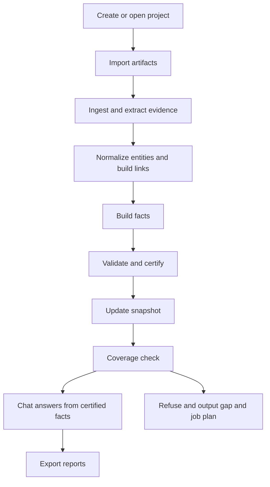

# SerapeumAI overview (Build Bible primary product story)

This overview intentionally treats the **Build Bible truth-engine contract** as the primary product story, even if the current canonical user docs do not fully reflect it yet.

Primary product-story sources:

- [`build bible.txt`](build bible.txt:1)
- [`full user journey  user flow.txt`](full user journey  user flow.txt:1)
- [`end-to-end user journey.txt`](end-to-end user journey.txt:1)
- [`user journey.txt`](user journey.txt:1)

Canonical user-facing docs referenced for current UI wording and guardrails:

- [`README.md`](README.md:1)
- [`PRODUCT_INTENT.md`](PRODUCT_INTENT.md:1)
- [`docs/USER_MANUAL.md`](docs/USER_MANUAL.md:1)
- [`docs/SYSTEM_REQUIREMENTS.md`](docs/SYSTEM_REQUIREMENTS.md:1)
- [`docs/TROUBLESHOOTING.md`](docs/TROUBLESHOOTING.md:1)

Archive docs under [`docs/archive/`](docs/archive/DOCUMENTATION_INDEX.md:1) are treated as **historical**, not as the user contract.

## What the application is

SerapeumAI is a **Windows desktop app** for AECO document review that aims to behave like an **offline engineering truth engine**, not just a chat UI.

High-level framing:

- Ingest project artifacts into a local, reproducible store
- Extract deterministic evidence with provenance
- Build facts with lineage
- Validate and certify facts and links
- Allow chat and workflows to answer only from certified facts, otherwise refuse and output the coverage gaps and a job plan

Source: [`build bible.txt`](build bible.txt:8), [`full user journey  user flow.txt`](full user journey  user flow.txt:1)

Core promise (truth-engine contract):

- It answers only from **Certified Facts** and cites evidence pointers.
- If required facts or validated links are missing, it refuses and produces:
  - coverage gaps
  - the next pipeline jobs to run
- It remains local-first and privacy-first by default.

Source: [`build bible.txt`](build bible.txt:15), [`full user journey  user flow.txt`](full user journey  user flow.txt:4)

Non-goals (explicit boundaries):

- Not a cloud service, not a collaboration platform.
- Not a CAD/BIM authoring tool.
- Not an automatic compliance certification product; it is a review accelerator.

Source: [`README.md`](README.md:1), [`PRODUCT_INTENT.md`](PRODUCT_INTENT.md:1)

## Primary user concepts in the truth-engine model

The Build Bible introduces stricter semantics than the current user manual.

### Evidence

Atomic extracted items tied to a specific file version and location, for example:

- PDF text blocks with page and bounding box
- OCR spans with confidence
- Excel cells with sheet and cell reference
- IFC properties with GUID

Source: [`build bible.txt`](build bible.txt:23)

### Facts

The only answerable units of truth. Facts must include:

- typed value
- status such as VALIDATED
- lineage back to evidence

Source: [`build bible.txt`](build bible.txt:42)

### Links

Crosswalk links connect entities across domains and must be VALIDATED before they are usable.

Source: [`build bible.txt`](build bible.txt:169)

### Snapshots

Answers are version-correct and refer to an explicit as-of snapshot.

Source: [`build bible.txt`](build bible.txt:47)

### Project

A project is a named workspace that points to a **root folder** on disk. The app scans and ingests supported files in that folder and builds data structures so you can search and chat.

Source: [`docs/USER_MANUAL.md`](docs/USER_MANUAL.md:9)

### Documents and status

Documents appear with status indicators such as Ready, Processing, or Error.

Source: [`docs/USER_MANUAL.md`](docs/USER_MANUAL.md:21)

### Pipeline (processing)

The manual describes a background processing pipeline including:

- Text extraction
- Vision/OCR for scanned content
- Indexing
- Cross-document linking
- Preparation for compliance review and chat

User guidance is: processing should run before results are reliable.

Source: [`docs/USER_MANUAL.md`](docs/USER_MANUAL.md:24)

In the truth-engine framing, pipeline is not just indexing. It is the only path for content to become:

- reproducible evidence
- canonical entities
- validated links
- certified facts

Source: [`end-to-end user journey.txt`](end-to-end user journey.txt:62)

## Key workflows as the user should experience them

The canonical manual describes Documents, Chat, Compliance, Graph. The Build Bible and journey specs extend this with Facts, Coverage, Validation, and Snapshots as first-class user surfaces.

### First launch

Typical first-run prompts may include:

- Choosing a local AI model (or confirming a default)
- Confirming a default storage location for app data

Source: [`docs/USER_MANUAL.md`](docs/USER_MANUAL.md:50)

### Create or open a project

- Create a project name
- Choose a root folder that contains files
- Then run processing

Source: [`docs/USER_MANUAL.md`](docs/USER_MANUAL.md:65)

### Documents: ingest and preview

- Add documents by placing them in the project folder and using Rescan/Refresh, or an Add files button if present
- Run processing via Run Pipeline, Process Project, or similar
- Preview PDF/text/image outputs, noting that scanned documents may require OCR/vision

Source: [`docs/USER_MANUAL.md`](docs/USER_MANUAL.md:110)

### Facts and coverage: can the system answer

Before asking questions, the user should see a coverage surface that answers:

- which question families are answerable for the selected snapshot
- which fact types or validated link types are missing
- which jobs to run next

Source: [`end-to-end user journey.txt`](end-to-end user journey.txt:216), [`full user journey  user flow.txt`](full user journey  user flow.txt:382)

### Validation queue: certify what blocks answerability

The user should be able to approve or reject candidate facts and candidate links, using direct evidence pointers.

Source: [`end-to-end user journey.txt`](end-to-end user journey.txt:152), [`build bible.txt`](build bible.txt:300)

### Chat: strict answering protocol with citations

Chat is a planner and narrator that must follow a strict protocol:

1. Identify a question template and parameters
2. Run coverage check
3. If incomplete, refuse and output gaps plus job plan
4. If complete, retrieve facts and links via whitelisted queries
5. Answer with evidence pointers

Sources: [`build bible.txt`](build bible.txt:347), [`end-to-end user journey.txt`](end-to-end user journey.txt:234), plus current UI framing in [`docs/USER_MANUAL.md`](docs/USER_MANUAL.md:152)

### Compliance review

Workflow:

1. Select a standard or standard pack
2. Click Analyze
3. Review findings with evidence and citations

Source: [`docs/USER_MANUAL.md`](docs/USER_MANUAL.md:198)

### Graph view

Graph view visualizes document relationships, shared entities, and clusters.

Source: [`docs/USER_MANUAL.md`](docs/USER_MANUAL.md:230)

### Exporting

Depending on build, exports may include compliance reports, findings lists, or chat transcripts.

Source: [`docs/USER_MANUAL.md`](docs/USER_MANUAL.md:268)

## System constraints and expectations

- Windows 10/11 64-bit
- Python 3.10 minimum, 3.11 recommended
- 16 GB RAM minimum, 32 GB recommended
- GPU optional; recommended for vision/OCR and faster chat
- SSD strongly recommended

Source: [`docs/SYSTEM_REQUIREMENTS.md`](docs/SYSTEM_REQUIREMENTS.md:7)

## Common failure modes (user-facing)

- App fails to start due to Python/env mismatch or missing modules
- Model not detected / AI not responding due to missing model selection, missing model file, or insufficient RAM/VRAM
- Performance issues on CPU-only hardware or large scanned projects
- PDF extracted text is empty for scanned PDFs until vision/OCR runs

Source: [`docs/TROUBLESHOOTING.md`](docs/TROUBLESHOOTING.md:15)

## Primary flow diagram (truth-engine)

## Key documentation boundaries

The intent document sets strict documentation rules:

- User-facing docs should match shipped UI, not ambitions.
- User docs should avoid internal architecture, module names, and code blocks.
- User-facing docs should have one run path: `python run.py`.

Source: [`PRODUCT_INTENT.md`](PRODUCT_INTENT.md:44)

